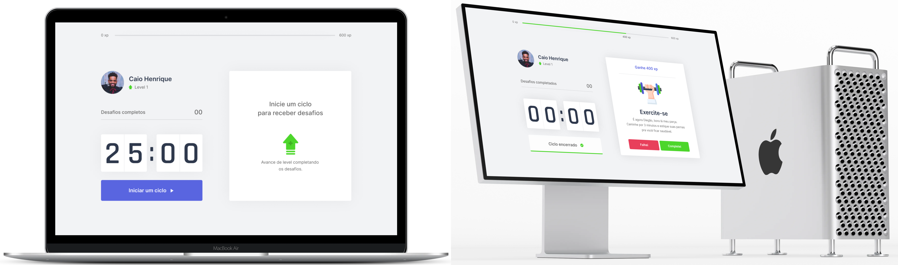
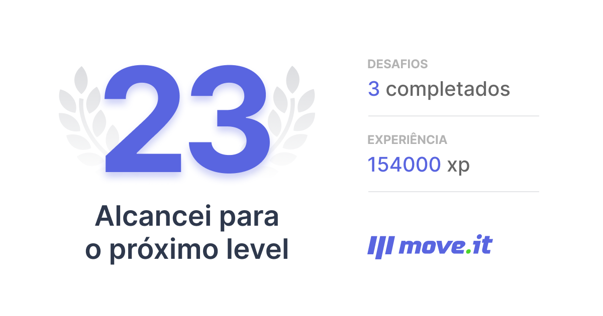

### <a name="top"></a>

<h1 align="center">
  <a href="https://moveit-web-phi.vercel.app/">
    
  </a>
</h1>

<h5 align="center">
    🙅‍♂️ This app suggests that you stretch your body if you stay in the same position for a long time.
</h5>

<p align="center">
  <!-- <a href="#-feat-">💎 Feat</a>&nbsp;&nbsp;&nbsp;&nbsp;|&nbsp;&nbsp;&nbsp; -->
  <a href="#-techs-">🛸 Techs</a>&nbsp;&nbsp;&nbsp;&nbsp;|&nbsp;&nbsp;&nbsp;
  <a href="#-prerequisites-">⚠️ Prerequisites</a>&nbsp;&nbsp;&nbsp;&nbsp;|&nbsp;&nbsp;
  <a href="#-how-to-use-">❔ How To Use</a>&nbsp;&nbsp;&nbsp;&nbsp;|&nbsp;&nbsp;&nbsp;
  <a href="#-badges-">🔖 Badges</a>&nbsp;&nbsp;&nbsp;&nbsp;|&nbsp;&nbsp;&nbsp;
  <a href="#-license-">🔐 License</a>&nbsp;&nbsp;&nbsp;&nbsp;|&nbsp;&nbsp;&nbsp;
  <a href="#-contact-me-">☎ Contact Me</a>
</p>

<br><br>

<p align="center">
  
</p>

<br>

## [🔝](#top) Feat 💎


- [x] Countdown
  - [x] Restart countdown
- [x] Challenges
  - [x] Completed or failed challenges
- [x] Levels
- [x] Experience
- [x] Pop-up congratulations
- [ ] Effects & Animations
- [ ] PWA
- [ ] Change your avatar and profile name
- [ ] GitHub login
- [ ] Share experiences in any social community
- Any suggestion?
  - <a href="#-contact-me-">Contact me!</a>

## [🔝](#top) Techs 🛸

<table>
  <tr align="center">
    <th>dependencies</th>
    <th>devDependencies</th>
  </tr>
  <tr align="center">
    <td><a href="https://github.com/js-cookie/js-cookie">JavaScript Cookie</a></td>
    <td><a href="https://github.com/conventional-changelog/commitlint">Commitlint</a></td>
  </tr>
  <tr align="center">
    <td><a href="https://vercel.com/solutions/nextjs">Next.js</a></td>
    <td><a href="https://github.com/commitizen/cz-cli">Commitizen</a></td>
  </tr>
  <tr align="center">
    <td><a href="https://reactjs.org/">ReactJS</a></td>
    <td><a href="https://github.com/typicode/husky">Husky</a></td>
  </tr>
  <tr align="center">
    <td rowspan="2"></td>
    <td><a href="https://semantic-release.gitbook.io/semantic-release/">Semantic-release</a></td>
  </tr>
  <tr align="center">
    <td><a href="https://www.typescriptlang.org/">TypeScript</a></td>
  </tr>
</table>

## [🔝](#top) Prerequisites ⚠️

In order to use and test this project locally, you should've already setup the development environment. <br>
_Or go to [**moveit-web-phi.vercel.app**](http://moveit-web-phi.vercel.app/) to see the project in a production environment._

## [🔝](#top) How To Use ❔

To clone and run this application locally, you'll need [Git](https://git-scm.com), [Node.js v10.16][nodejs] or higher + [Yarn v1.13][yarn] or higher installed on your computer.

<details open>
  <summary>Hit me to toggle collapse: 🕹️<sup>🤏</sup></summary>

  _From your `command line` follow these steps..._

  ```bash
  # Clone the project
  $ git clone https://github.com/caiohenrique-developer/moveit-web 'Move.it Web' && cd 'Move.it Web'

  # Install dependencies
  $ yarn
  # or
  $ npm i

  # Start the project
  $ yarn dev
  
  # Very well, now you can enjoy this project! ;)
  ```
</details>

<br>

<p align="center">
  
</p>

## [🔝](#top) Badges 🔖

<p align="center">
  

  

  <a href="https://www.codacy.com/app/caiohenrique-developer/moveit-web?utm_source=github.com&amp;utm_medium=referral&amp;utm_content=caiohenrique-developer/moveit-web&amp;utm_campaign=Badge_Grade">
    
  </a>

  <a href="https://github.com/caiohenrique-developer/moveit-web/commits/master">
    
  </a>

  <a href="https://github.com/caiohenrique-developer/moveit-web/releases">
    
  </a>

  <a href="https://github.com/caiohenrique-developer/moveit-web/tags">
    
  </a>

  <a href="https://github.com/caiohenrique-developer/moveit-web/issues">
    
  </a>

  

  

  <a href="https://github.com/semantic-release/semantic-release">
    
  </a>

  

  

  

  <!--  -->

  

  

  

  

  <a href="https://moveit-web-phi.vercel.app/">
    
  </a>
</p>

## [🔝](#top) License 🔐

Copyright © 2021 MoveIt, [MIT](https://github.com/caiohenrique-developer/moveit-web/blob/master/LICENSE) .
###### _This project is under the <sup>MIT</sup> license. See the license for more information._

---

<blockquote align="center">“Always running in search of the goals!” <br> Done with ♥ by myself 👇 <a href="#-contact-me-">Get in touch!</a></blockquote>

## [🔝](#top) Contact Me ☎

<p align="left">
  

  <br>

  <a href="https://www.linkedin.com/in/caio-henrique-024627171">
    
  </a>
  <a href="mailto:caiohenrique.developer@gmail.com">
    
  </a>
  <a href="https://api.whatsapp.com/send?phone=5511943902438&text=Fala%20Caio,%20como%20vai?">
    
  </a>
</p>

[nodejs]: https://nodejs.org/
[yarn]: https://yarnpkg.com/
[vc]: https://code.visualstudio.com/
[vceditconfig]: https://marketplace.visualstudio.com/items?itemName=EditorConfig.EditorConfig
[vceslint]: https://marketplace.visualstudio.com/items?itemName=dbaeumer.vscode-eslint
[vcprettier]: https://prettier.io/